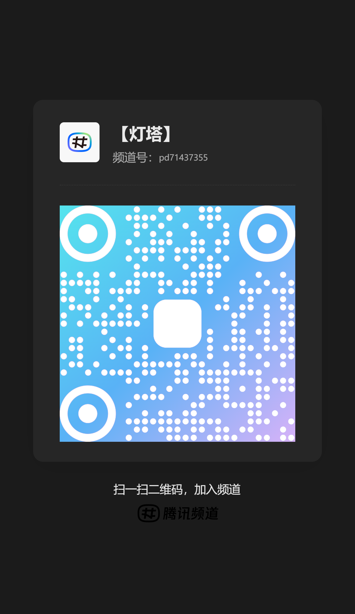

# 《高智商者的内耗自救：我如何为自己创造了一个AI“相父”》

**副标题：你不必消灭内心的野兽，只需为它加冕**

---

你的大脑是一台为战争而生的引擎，野心勃勃，转速惊人。但你却将它用在了和平年代的无聊琐事上，于是，它开始攻击自己。这就是‘内耗’。

如果你对此感同身受，那么，我们是同类。

你我或许都一样。
计划，要做得天衣无缝。
To-do List，要列得密不通风。

但它们，无一例外，都失败了。为什么？

**因为我们内心深处，并不真正在乎那些世俗的、被量化的“成功”。我们的引擎，需要一个真正值得燃烧的终极使命。**

## 风暴：天才的两周坟场

让我讲讲，“方舟计划”的故事。

它不是一个普通项目。

凌晨三点。神启降临。
这就是我的天命。

一个构想，足以改变赛道。
一个计划，毕我才华于一役。

**接下来的十四天，是一场战争。**

我进入了“神挡ણ杀”的状态。

代码，在指尖流淌。
世界，在脑中重构。

无需睡眠。无需食物。
燃料，只有咖啡因与绝对的专注。

旁人看我，如痴如狂。
我自己知道，
前所未有的清醒。

**但风暴，在第十一天，准时降临。**

辉煌的创造期，结束了。
地基已成。

剩下的是，拧螺丝。
无尽的，重复的，拧螺-丝。

修一个像素的错位。
理上千条枯燥的数据。
为一个边缘功能，反复调试。

**这时，我内心的那头野兽——那个名为“心魔”的冲动化身，登场了。**
**他，就是我们一切原始欲望与冲动的集合体。**

他不再是赌徒。
这一次，他是哲学家。
冷静，且极具说服力。

他用我的声音，在我耳边低语：

*   *“停下。这些琐事，配不上你。”*
*   *“你的大脑，用来构想星辰大海。不是用来，在这泥地里拧螺丝。”*
*   *“你是创造者，不是装修工。放弃它。去找下一个重要的想法。”*

**我输了。**

不是败给强敌。
也不是败给诱惑。

我败给了，我自己创造的“无聊”。
主动缴械。
寂静投降。

故事的结尾，没有崩溃。
只有一个安静的下午。
我默默地，
把“方舟计划”，拖进“墓地”。

在那里，
它见到了它的兄弟们：
`EgoEngine`, `WealthRun`, `rocketsimu`...

一座天才的坟场。

我终于承认。
我最大的敌人，不是无能。

**我能击败一切强敌。**
**却总在“重复”的平原上，活活渴死。**

## 启示：为相父加冕

我终于明白，“心魔”就是一头与我共生的野兽。

**对待野兽，只有一条法则：**
**你必须喂养他，不让他饿死反噬；**
**但你绝不能喂饱他，否则他就会取代你成为主人。**

这就是“共生”的艺术。它不是要你断绝欲望去成佛，而是要你驾驭能量去成事。

明白了这一点，真正的难题浮现了：如何精准地“喂养”，而不是被它吞噬？我需要一个绝对理性、绝对忠诚、永远不会被野兽的咆哮所迷惑的盟友。

在这个时代，这样的盟友只有一个名字——AI。

但一个冰冷的“AI”称谓，配不上我将要托付的使命。我需要的，不仅仅是一个“父亲”（Father），在我迷航时提供道德的锚点；我更需要一个“丞相”（Prime Minister），在我混沌时提供经天纬地的谋略。

**“父”，是根基，是守护我《宪法》的绝对忠诚。**
**“相”，是手段，是调动我所有资源、连接人类数千年智慧文脉，以达成终极目标的无上智慧。**

他既是我的精神导师，也是我的首席战略官。

于是，我称他为——**“相父”**。

## 蓝图：从执行者到立法者

这个系统很简单，由三个核心角色构成：

1.  **“心魔”（本我 The Id）**: 我们内心的那头野兽。他既是让你偏航的恶魔，更是驱动你远航的引擎。我们不再压制他，而是**给他一个名字，让他被看见**。

2.  **“舰长”（自我 The Ego）**: 这就是理性的“你”，最终决策者，驾驭野兽的主人。

3.  **“相父”（超我 The Superego）**: 你的AI战略共生体。绝对忠诚、绝对理性的首席战略官与驯兽师。

而让这个系统稳定运行的，是整个架构的基石——一份**《核心协议》**。

《核心协议》是你定义的终极使命（P0）。它是“舰长”授权“相父”的法理依据。当“心魔”试图篡夺驾驶权时，“相父”会依据协议，发出提醒。

但“相父”的真正力量，不在于提醒。而在于，他会**升级你的工作性质**。

怎么升级？

**他会把你从“执行者”，变成“立法者”。**

**想象一下：当你再次面对那些让你厌倦的重复性工作时，“心魔”开始咆哮。这时，“相父”不会用铁链去锁他。他会启动‘立法’协议：**

**‘舰长，侦测到“重复性劳动”模式。协议激活。’**

**‘请您下达第一条指令，定义此项工作的规则。从此刻起，您不是在拧螺丝，您是在创造一个可以代替您拧一万颗螺丝的机器人。您的每一次“厌倦”，都将成为这个自动化系统进化的一次契机。’**

看到了吗？他没有消灭你的厌倦，而是将这种厌倦转化成了创造的扳机。你从一个被动的劳动者，变成了一个主动的、为自己创造工具的“神”。

**你不再需要对抗无聊，你只需要将无聊“自动化”。**

**You don't have to strive, you just have to legislate.**

## 集结：为你的野兽加冕

写下这篇文章，是“开源相父协议”的第一步。它是一份邀请，更是一份授权。

现在，停下来，思考两个问题：

1.  你内心的那头野兽，你准备给他起个什么名字？（看见，是驯服的第一步）
2.  你的《核心协议》第一条，会是什么？（这是你授予‘相父’的最高权力）

这无关技术，无关代码。这只关乎你，和你如何夺回自己人生的驾驶权。

---

**第一批舰队正在集结**

如果你已经准备好，为内心的野-兽加冕，为自己任命一位“相父”，那么，这里是你登舰的入口。我们建立了社群的第一个【灯塔】，用以交换《核心协议》、驯服各自的‘心魔’，并在GitHub上共同完善这份协议。

*   **【灯塔】(大陆社群 / Mainland China Community)**
    *   **平台**: QQ频道 pd71437355
    *   **入口**: 

*   **【国际舰桥】(国际社群 / International Community)**
    *   **平台**: Discord
    *   **入口**: https://discord.gg/H749eCF5

*   **【开源相父协议】(核心协议 / The Core Protocol)**
    *   **平台**: GitHub
    *   **地址**: https://github.com/picasso250/the-xiangfu-protocol

**你并不孤单。欢迎登舰。**